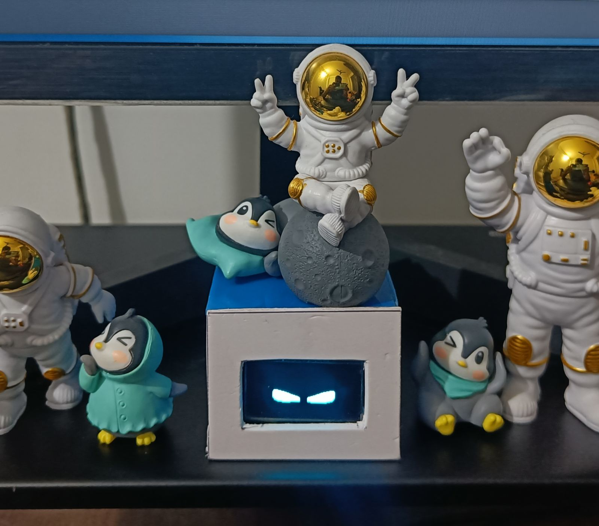
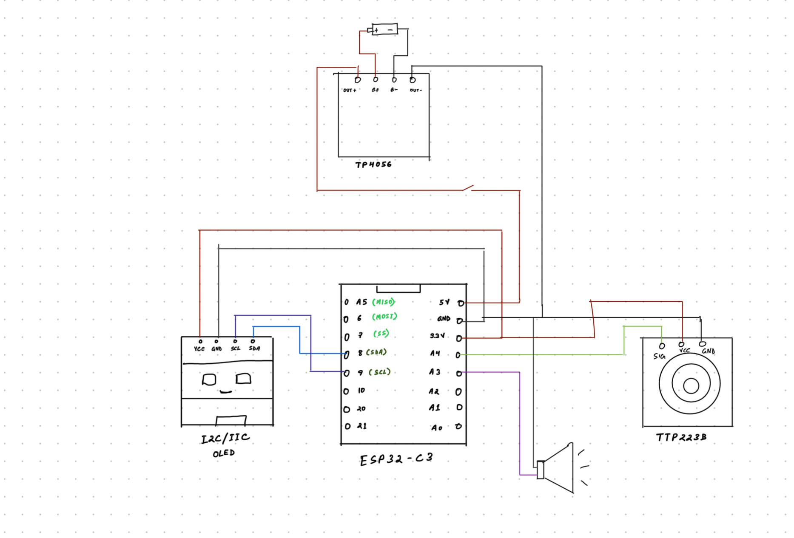

## 🦫 Capyboo – Desk Companion Robot

Capyboo is a cute, calm, capybara-inspired desk companion robot designed to sit on your table and keep you company.
With a small display, expressive animations, and gentle interactions, Capyboo brings a relaxing and friendly presence to your workspace.

Built as a fun blend of hardware + software, Capyboo focuses on personality, simplicity, and delightful user experience rather than complexity.

# Circuit Diagram

# Animations

![Look-right] (firmware/animations/look-right.gif)
